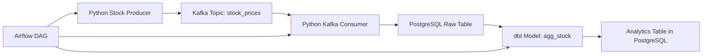
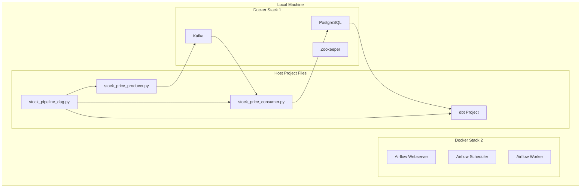

# Stock Market Data Pipeline Project Documentation

## Project Overview

This project was built as a practical, local-first data engineering system to demonstrate real-time ingestion, streaming, transformation, and orchestration skills using Kafka, PostgreSQL, dbt, and Airflow.

The main goal was not to build a toy tutorial project, but to create something that reflects the kind of work expected from data engineers who aim for higher salary bands and more senior responsibilities.

## Purpose of the Project

The project was designed to answer a simple but important question:

> Can a small, local, reproducible pipeline simulate the structure and behavior of a real production data platform?

To achieve that, the pipeline was planned around a stock market domain because it naturally fits:
- real-time event generation
- streaming ingestion
- relational storage
- analytical transformation
- orchestration and scheduling

## What We Were Trying to Achieve

We wanted to build a pipeline with these stages:

1. Generate stock market events
2. Send them to Kafka
3. Consume them from Kafka
4. Store the raw data in PostgreSQL
5. Transform the raw data using dbt
6. Orchestrate the whole flow with Airflow

The bigger objective was to gain practical understanding of:
- Kafka producer/consumer flow
- containerized infrastructure
- dbt project structure
- incremental transformation concepts
- orchestration using Airflow
- debugging cross-container networking and dependency issues

## Architecture Diagram



## System Architecture



## What We Built

### 1. Kafka-based stock event pipeline
A Python producer was written to simulate stock prices and publish events into Kafka.

### 2. Kafka consumer to PostgreSQL
A Python consumer was written to read Kafka messages and insert them into a PostgreSQL table.

### 3. dbt transformation layer
A dbt project was created to read raw stock data and build analytical models such as aggregated stock prices by date and symbol.

### 4. Airflow orchestration
An Airflow environment was created to eventually orchestrate producer, consumer, and dbt steps as one workflow.

## Key Components

### Kafka Producer
The producer script generates stock-related data and publishes it to a Kafka topic.

Typical responsibilities:
- create fake or simulated stock values
- serialize events as JSON
- publish to Kafka topic
- run continuously or on a schedule

### Kafka Consumer
The consumer reads events from Kafka and loads them into PostgreSQL.

Typical responsibilities:
- subscribe to the Kafka topic
- deserialize messages
- insert raw events into relational tables
- handle basic connection and write logic

### PostgreSQL
PostgreSQL acted as the raw storage layer.

It was used to:
- store raw stock event data
- serve as the source for dbt models
- preserve a structured version of streaming events

### dbt
dbt was used to model and transform the raw data into analytics-ready tables.

This included learning:
- `dbt run`
- `dbt test`
- `ref()`
- `source()`
- `{{ this }}`
- incremental model concepts
- schema definitions
- model descriptions and column tests

### Airflow
Airflow was intended to orchestrate the end-to-end workflow.

We worked through:
- creating and locating DAGs
- container volume mapping
- Airflow UI access
- DAG visibility issues
- dependency issues inside containers
- Python package installation inside the Airflow image
- Kafka networking issues between containers

## What We Achieved

We successfully learned and demonstrated:
- Kafka producer/consumer fundamentals
- PostgreSQL raw ingestion
- dbt project setup and model creation
- Airflow deployment and UI access
- debugging of Docker container mounts and networking
- understanding of how dbt transformations differ from ingestion and orchestration

Even though some parts of the Airflow/Kafka integration remained unstable during debugging, the core learning objective was achieved:
the project now reflects a realistic local data engineering workflow rather than isolated scripts.

## Problems and Challenges Faced

### 1. yfinance was unstable
Attempting to use `yfinance` for live stock data caused connection timeouts and empty responses.

#### How we handled it
We replaced external API dependence with locally simulated stock price generation.

### 2. Kafka networking issues inside Docker
The Airflow container could not initially reach Kafka and produced `NoBrokersAvailable` errors.

#### What we learned
- `localhost` inside a container does not refer to the host machine
- containers need proper network visibility
- Kafka listeners and advertised listeners matter
- Docker Compose network separation affects service discovery

### 3. Docker volume path confusion
Airflow DAGs and scripts were not appearing in the UI because the volume mapping was incorrect or reversed.

#### What we learned
- host path and container path must be mapped correctly
- container `/opt/airflow/dags` must map to a real host folder
- Docker Desktop and WSL add extra complexity to file path resolution

### 4. Missing Python package inside Airflow container
The Airflow task failed with `ModuleNotFoundError: No module named 'kafka'`.

#### What we learned
- host Python packages are not available inside containers
- container dependencies must be installed inside the container image or via startup requirements

### 5. dbt configuration confusion
There was confusion around:
- model names
- schema settings
- starter example models
- `ref()` vs `source()`
- incremental model behavior

#### What we learned
- dbt models are transformed SQL assets
- dbt does not ingest data
- dbt uses model files to create tables/views
- dbt sources are the right way to refer to external raw tables

## How We Overcame These Problems

We resolved or understood most of the issues through iteration:

- replaced unstable API usage with a local data generator
- successfully wrote Kafka messages and loaded them into PostgreSQL
- created a working dbt project and ran models
- learned how Airflow depends on correct file mounts and package availability
- debugged Docker Compose and container networking behavior
- cleaned up the project conceptually so the pipeline stages are distinct

## Lessons Learned

This project taught several high-value lessons:

### 1. Containers are isolated environments
Your local machine and Docker containers are not the same environment.

### 2. Orchestration is not transformation
Airflow schedules work. dbt transforms data. Kafka moves events.

### 3. Raw data, modeled data, and orchestrated workflows are different layers
A professional pipeline separates these concerns cleanly.

### 4. Docker debugging is a real engineering skill
Mounts, networks, container names, and image dependencies all matter.

### 5. dbt is a real part of modern analytics engineering
It is not just a SQL wrapper. It creates structure, lineage, testing, and maintainability.

## Current Status

At the time of this documentation:
- Kafka and PostgreSQL-based ingestion concepts were built and tested
- dbt was configured and run successfully
- Airflow was created, debugged, and partially integrated
- the project has enough substance to be documented and shared on GitHub
- the remaining work is mostly cleanup, stabilization, and packaging

## Future Improvements

If the project is continued, the next sensible steps would be:
- stabilize Airflow orchestration
- make the dbt model cleaner and more production-like
- add tests for schema and data quality
- document the final pipeline in GitHub README
- add screenshots of Kafka, dbt, PostgreSQL, and Airflow UI
- optionally add a dashboard layer
- later introduce Spark/stream processing if needed

## Suggested Repository Structure

```text
stock_market_pipeline/
├── airflow/
│   ├── dags/
│   └── scripts/
├── dbt/
│   └── stock_dbt_project/
├── kafka/
│   └── stock_price_producer.py
├── postgres/
│   └── raw_load.sql
├── docs/
│   └── stock_market_pipeline_documentation.md
├── screenshots/
├── docker-compose.yml
├── README.md
└── requirements.txt
```

## Final Summary

This project was built to gain practical exposure to the modern data engineering stack in a local environment.

It started with a stock market domain and expanded into:
- Kafka event streaming
- PostgreSQL raw storage
- dbt transformations
- Airflow orchestration
- Dockerized infrastructure
- real debugging of dependency and networking problems

The project is valuable not because it is flawless, but because it reflects the actual messiness of building data systems in the real world. That is exactly what makes it useful for learning and for resume discussion.

## Notes for GitHub

Recommended files to include in the repository:
- `README.md`
- `docker-compose.yml`
- `requirements.txt`
- `stock_price_producer.py`
- `stock_price_consumer.py`
- dbt project files
- `stock_market_pipeline_documentation.md`

Do not commit:
- `.venv/`
- Airflow logs
- dbt target artifacts
- temporary cache files
- local Docker volumes
